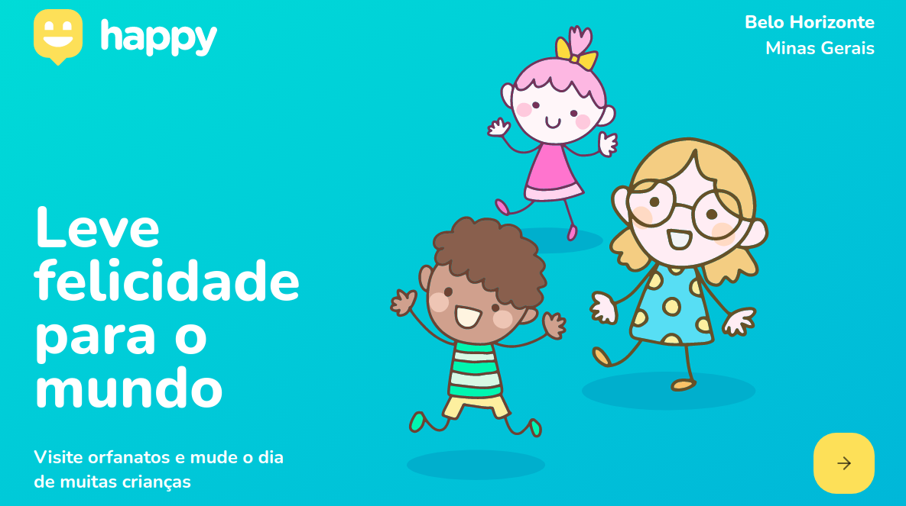

# Happy - NLW

> The project was developed during the Next Level Week promoted by Rocketseat

 

This application aims to facilitate the relationship between orphanages and visitors. It is possible to locate orphanages in the Belo Horizonte region and check their information, in addition users can register new orphanages.



## RUN :arrow_forward:

Make sure you have yarn installed at your computer.

:small_orange_diamond: enter on /web

```sh
yarn install
```

Runs the app in the development mode.
Open http://localhost:3000 to view it in the browser.
The page will reload if you make edits.
You will also see any lint errors in the console.

:small_orange_diamond: enter on /backend

```sh
yarn dev
```

Runs the app in the development mode.
The API will run at http://localhost:3333.

:bangbang: DON'T FORGET: You need to create and fill the dotenv file. You can follow the
example at web/src/.env-example.

## Meta :raising_hand:

Tárcila Fernanda Resende da Silva – [@tarcila414]

:mailbox: &nbsp; [](https://www.linkedin.com/in/t%C3%A1rcila-silva-6756101a5/) [](mailto:tarcila086@gmail.com)

## Contributing :triangular_flag_on_post:

1. _Fork_ it (<https://github.com/tarcila414/css-html/fork>)
2. Create your feature _branch_ (`git checkout -b feature/fooBar`)
3. _Commit_ your changes (`git commit -am 'Add some fooBar'`)
4. _Push_ to the branch (`git push origin feature/fooBar`)
5. Create a new _Pull Request_
